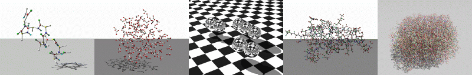

# ProtoMol 3.0 #

ProtoMol is an object-oriented, component based, framework for molecular dynamics (MD) simulations. The framework supports the CHARMM 19 and 28a2 force fields and is able to process PDB, PSF, XYZ and DCD trajectory files. It is designed for high flexibility, easy extendibility and maintenance, and high performance demands, including parallelization. The technique of multiple time-stepping is used to improve long-term efficiency. The use of fast electrostatic force evaluation algorithms like Ewald, particle Mesh Ewald (PME), and Multigrid (MG) summation further enhances performance. Longer time steps are possible using MOLLY, Langevin Molly and Hybrid Monte Carlo, Nose-Hoover, and Langevin integrators.

ProtoMol v2.0 has been designed to interact with VMD, a visualization engine developed by the University of Illinois that is used for displaying large biomolecular systems in three dimensions. Protomol v3.0 simulations can be visualized using the Open Source Jave Molecular Viewer, included in the download package.

ProtoMol is freely distributed software, and the source code is available.

## Key Features of ProtoMol 3.0 ##

*    Interface to OpenMM, an MD library with NVIDIA and ATI general purpose GPU support. OpenMM supports AMBER force fields and Generalized-Born implicit solvent. 

*    Python bindings offered as MDLab, which allow for prototyping of high level sampling protocols, new integrators, and new force calculations in Python. 

*    Coarse grained normal mode analysis (CNMA), which provides a scalable O(N^9/5) time and O(N^3/2) memory diagonalization. CNMA approximates low frequency modes very well.

*    Normal Mode Langevin (NML) dynamics, which uses CNMA to periodically compute low frequency bases for propagation of dynamics, while fast modes are minimized to their equilibrium position. NML allows timesteps of 100 fs and more for even small proteins (> 30 residues) with real speedups that are about a third of the timestep used.

*    Full checkpointing support, which simplifies use in distributed computing platforms such as Condor or Folding@Home.

## Key Features of ProtoMol ##

*    An object-oriented component based framework for molecular dynamics simulations
*    Designed for high flexibility, easy extendibility and maintenance, and high performance demands
*    Incremental parallelization combining sequential and parallel environment
*    Support of generic multiple time-stepping integration schemes
*    Generic forces and potentials
*    Fast electrostatic force evaluation algorithms:
* *         Ewald summation, O(N^3/2)
* *        Particle-Mesh-Ewald, O(N log N)
* *       Multi-grid method, O(N) 
*    Support of common I/O formats (pre- & post-processing)
*    10^6 particle systems

*    Supported platforms:
* *        Sun/Solaris
* *        AIX (optional with MPI)
* *        HP-UX (optional with MPI)
* *        IRIX (optional with MPI)
* *        Linux (optional with MPIch or LAMMPI)
* *        Windows 

# HOWTO install ProtoMol - Linux #


## USER INSTRUCTIONS ##

1) Run one configure script for your platform:

```
#!text
./configure                           # tries to find best preset
./configure --with-aix-xlc            # xlC   for AIX with optimization flags
./configure --with-aix-xlc-mpi        # xlC   for AIX with MPI and optimization flags
./configure --with-gcc                # g++   for generic with optimization flags
./configure --with-gcc-debug          # g++   for generic with debugging flags
./configure --with-gcc-mpich          # g++   for generic with MPICH flags
./configure --with-hpux-cc            # aCC   for HPUX optimization flags
./configure --with-hpux-cc-mpi        # aCC   for HPUX with MPI and optimization flags
./configure --with-icc                # icc   for generic with optimization flags
./configure --with-icc-mpich          # icc   for generic with MPICH and optimization flags
./configure --with-icc-mpich-debug    # icc   for generic with MPICH and debugging flags
./configure --with-irix-mipspro       # CC    for IRIX with optimization flags
./configure --with-irix-mipspro-mpi   # CC    for IRIX with MPI and optimization flags
./configure --with-ppc-xlc            # xlC   for PPC with optimization flags
./configure --with-sun-gcc            # g++   for SUN with optimization flags
```


2) Run depend target to generate dependencies and compile the framework:

```
#!text
   make depend; make
```


## DEVELOPER INSTRUCTIONS ##

1) Run one configure script for your platform:

```
#!text
./configure --with-aix-xlc                  #  xlC   for AIX with optimization flags
./configure --with-aix-xlc-debug            #  xlC   for AIX with debugging flags
./configure --with-aix-xlc-mpi              #  xlC   for AIX with MPI and optimization flags
./configure --with-aix-xlc-mpi-debug        #  xlC   for AIX with MPI and debugging flags
./configure --with-gcc                      #  g++   for generic with optimization flags
./configure --with-gcc-debug                #  g++   for generic with debugging flags
./configure --with-gcc-debug-gdb            #  g++   for generic with debugging and gdb flags
./configure --with-gcc-mpich                #  g++   for generic with MPICH flags
./configure --with-gcc-mpich-debug          #  g++   for generic with MPICH debug flags
./configure --with-hpux-cc                  #  aCC   for HPUX optimization flags
./configure --with-hpux-cc-debug            #  aCC   for HPUX with debugging flags
./configure --with-hpux-cc-mpi              #  aCC   for HPUX with MPI and optimization flags
./configure --with-hpux-cc-mpi-debug        #  aCC   for HPUX with MPI and debugging flags
./configure --with-icc                      #  icc   for generic with optimization flags
./configure --with-icc-debug                #  icc   for generic with debugging flags
./configure --with-icc-mpich                #  icc   for generic with MPICH and optimization flags
./configure --with-icc-mpich-debug          #  icc   for generic with MPICH and debugging flags
./configure --with-irix-mipspro             #  CC    for IRIX with optimization flags
./configure --with-irix-mipspro-debug       #  CC    for IRIX with debugging flags
./configure --with-irix-mipspro-mpi         #  CC    for IRIX with MPI and optimization flags
./configure --with-irix-mipspro-mpi-debug   #  CC    for IRIX with MPI and debugging flags
./configure --with-ppc-xlc                  #  xlC   for PPC with optimization flags
./configure --with-pcc-xlc-debug            #  xlC   for PPC with debugging flags
./configure --with-sun-gcc                  #  g++   for SUN with optimization flags
```
   					    
We recommend for testing purpose to use debugging since it takes less time to compile.


2) Run depend target to generate dependencies and compile the framework:

```
#!text
make clean; make depend; make
```

   We recommend to do a "make clean" since the dependencies are not always
   correctly encountered.


## Adding new files to the framework or the applications ##


1) Add your new files to the Makefile.am in the same directory

2) Generate the new configure file:

```
#!text
autoreconf -f -i  --verbose
```

   or

```
#!text
./realmake <arguments>                          # cleans up all and runs autoconf
```

   or if you do not have autoconf >= V2.53

```
#!text
aclocal; autoheader; autoconf; automake -a      
```


## Adding new Makefile directories ##

1) You have to add your new Makefile filename relative to
   the root of protomol into configure.ac  (at the end of the file),
   and the directory name parent to it.

2) Generate the new configure file as under addinf files.


## HOWTO set compiler flags ##

   This can be done if you don't want to use the --with-platform-cxx configure
   options
 
   Set CXX environment variable to the compiler you want to use 
   (e.g. setenv CXX g++)
 
   Set CXXFLAGS environment variable to the compiler flags you want to use
   (e.g. setenv CXXFLAGS "-O3")

   Example:
```
#!text
./configure 'LIBS=-lm -lnsl' 'CC=/opt/scali/bin/mpicc' 'CFLAGS=-Wall -O9 -ffast-math -finline-functions -funroll-loops -DHAVE_APP_MPI -DHAVE_MPI -DNDEBUG' 'CXX=/opt/scali/bin/mpic++' 'CXXFLAGS=-Wall -O9 -ffast-math -finline-functions -funroll-loops  -DHAVE_APP_MPI -DHAVE_MPI -DNDEBUG' '--with-fftw3=/local/fftw'
```

 
   For more detailed informations:
```
#!text
./configure --help
```


## Compiler troubles ##

   If the check of your compiler(s) fails try another configurations or you may 
   change/remove some compiler flags or libraries in ./configure.ac. If you have 
   still have troubles to compile or run automake/autoconf take look at FAQ.compiler.
 
   If you have troubles to link/compile with external libraries you may look at 
   test programs in compilerTests to figure out the compiler/library flags.
 
 
##  Autoconf troubles / older versions ##

   configure.ac expects autoconf version 2.53 or higher, in order generate makefiles 
   with older autoconf versions edit configure.ac and comment out what is below 
   Autoconf 2.53 and uncomment below Autoconf 2.13 and copy configure.ac to configure.in
   You may also use a symbolic link to configure.in and use:
   aclocal; autoheader; autoconf; automake -a

### 64-bit ###

   ProtoMol supports compilation of 32-bit and 64-bit. On AIX you change to 64 with:
   setenv OBJECT_MODE 64 


### PNG ###

   The io library supports a PNG writer, but also PPM.


### GLUT ###

   GLUT is a tool library to simplify OpenGL usage.


### FFT ###

   ProtoMol supports different FFT interfaces: 
* FFTW (version 3 and 2)
* ESSL (AIX)
* complib.sgimath (IRIX)
   You can specify your FFT of choice by --with-fft=[sgi|essl|fftw2|fftw3|zfft].

   Use '--with-fftw3=<path>' to specify install path of FFTW, ESSL and complib.sgimath are assumed to
   be at default locations. If you do not have any of these FFT libraries, ZFFT is used by default,
   which is a subsitute for complib.sgimath. Note that ZFFT does not support all kind of numbers.
   Note that ESSL's FFT does not handle all kind of numbers. ESSL aborts with the error message 
   "DCFT3 : 2538-2030 The transform length (ARG NO. 7, 8 or 9)", where 7 stands for the z-dim, 
   8 the y-dim and 9 the x-dim. [www.fftw.org](http:://www.fftw.org)
   


## Timing ##

```
#!text
   wall        : totale time, incl. initialization & IO
   run         : running the simulation for n steps, incl. output
   integration : running the simulation for n steps, excl. output
   forces      : evaluating the forces, excl. communication
   com         : sending and recieving data
   idle        : waiting for the master to send next work package and waiting for barrieres 
```


## Parallel ##

```
#!text
   useBarrier   : boolean =false  : if MPI_Barrier should be called before global communication
   parallelMode : string          : static, dynamic or masterSlave
                  =static     : static load balancing, no com. between master and slaves, only slaves
                  =dynamic    : master-slave, where the master does some work in-between, 
                                parallelPipe should be accordingly set
                  masterSlave : pure master-slave, where the master serves the slaves
   maxPackages  : int             : max. number of work packages per node per force; increased 
                                    packages, better load balance, but more communication
   parallelPipe : int             : pipe size of packages send to each slave; increased pipe less idle
                                    slaves, but less load balancing
```


## NOTES ##

   Don't worry if it's taking a long time to compile ... 

   To clean the whole package:

```
#!text
./realclean
```